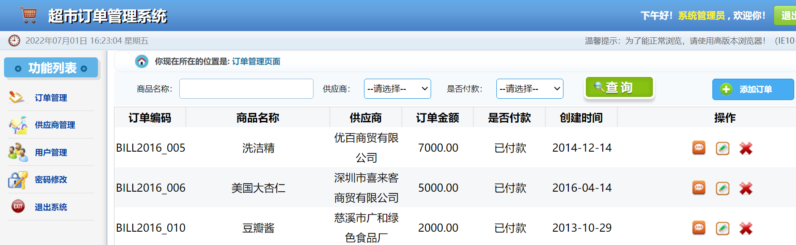

# smbms
#### 使用javaWeb写的超市管理系统

初始管理员账户：**admin**

初始管理员密码：**123456**

#### 包含功能：

- 订单管理
- 供应商管理
- 用户管理
- 密码管理

#### 项目截图

#### 项目参考

B站【遇见狂神说】JavaWeb项目【超市订单管理系统】

项目环境： JDK1.8  Tomcat9  MySql5.7
参考：
https://www.bilibili.com/video/BV12J411M7Sj
https://blog.csdn.net/TTiamo_/article/details/121115124